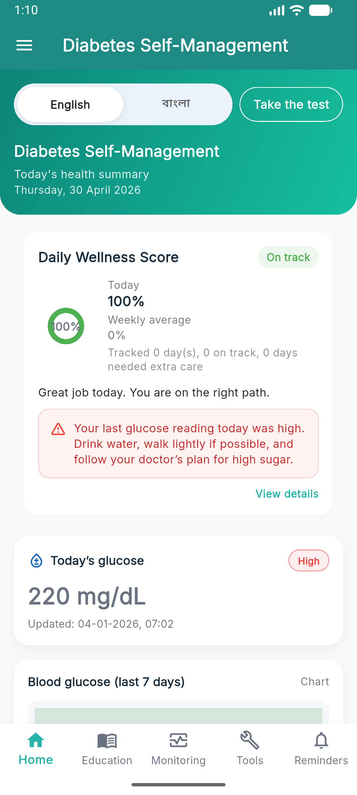
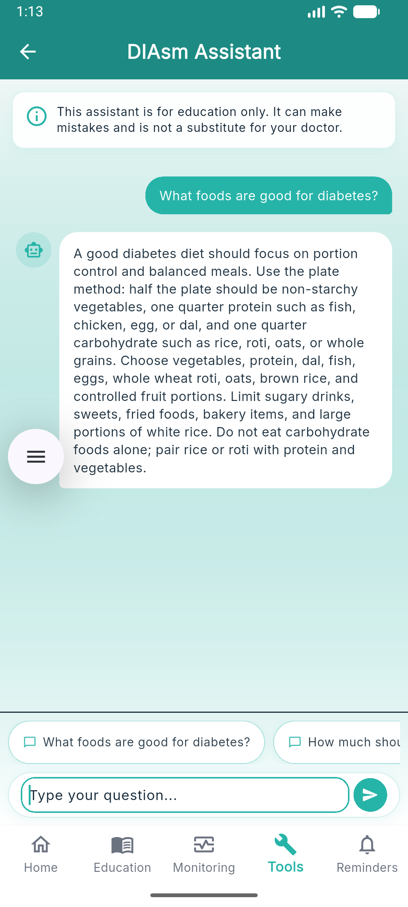
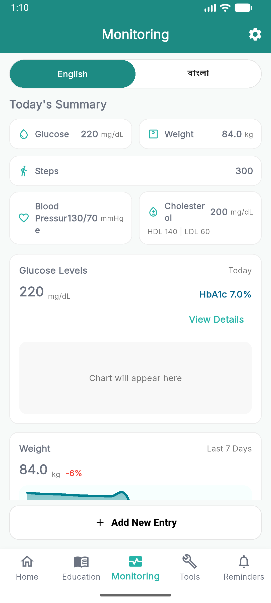
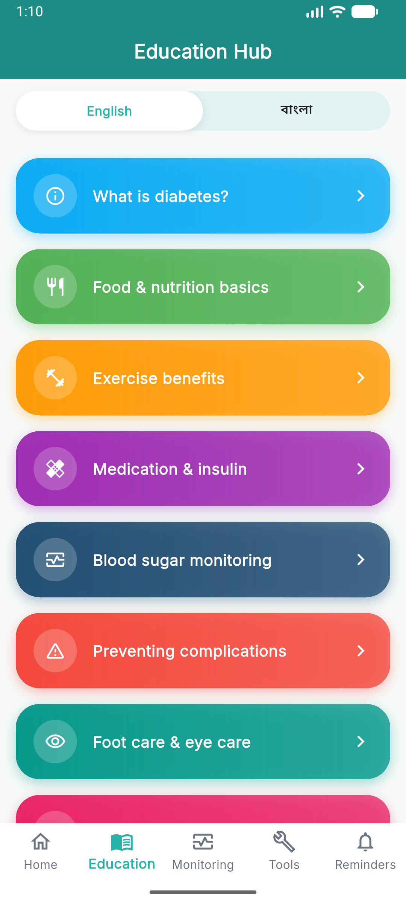
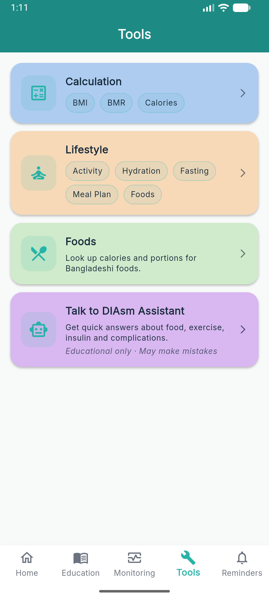
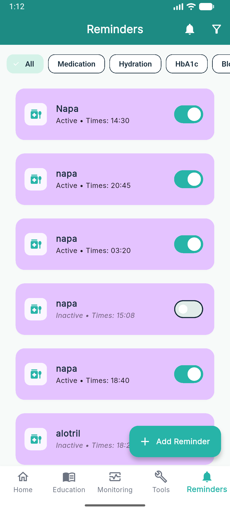
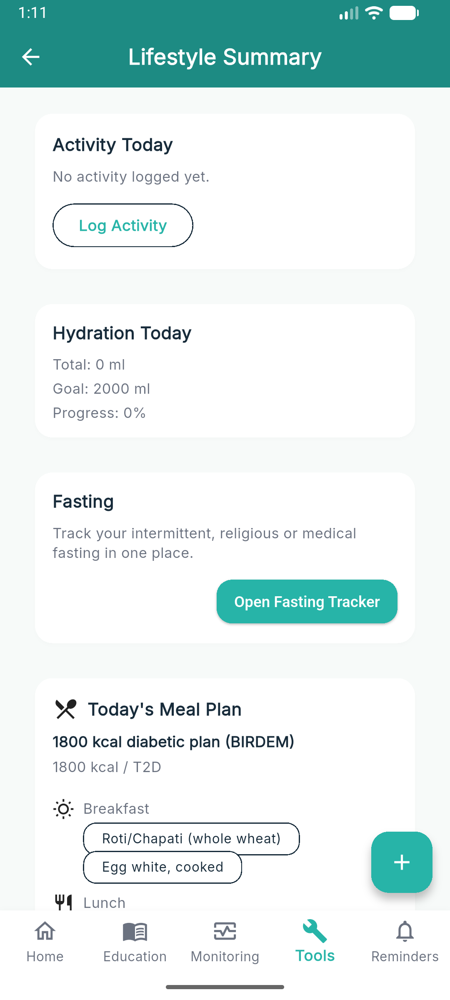

# DIAsm – Intelligent Diabetes Self-Management App

A full-stack mobile application designed to help users manage Type 2 Diabetes through lifestyle guidance, health tracking, and an AI-powered chatbot.

---

##  Features

-  AI Chatbot (RAG + LLM using ChromaDB + Ollama)
-  Personalized diet and meal planning
-  Exercise & lifestyle recommendations
-  Blood glucose & health tracking
-  Bangla + English support

## 🛠️ Tech Stack

- Frontend:** Flutter  
- Backend:** Node.js + Express + FastAPI  
- Database:** MySQL + ChromaDB  
- AI: Sentence Transformers + Ollama (LLaMA 3)

---

##  Project Structure
diabetes-backend/
│
├── src/ → Main backend API (routes, controllers, services)
├── ai-service/ → AI chatbot logic (RAG, intent detection, evaluation)
├── ai-data/ → Diabetes knowledge base (JSON)
├── public/uploads/ → Images for education module
├── scripts/ → Data processing & utilities
├── migrations/ → Database migration files
│

##  App Screenshots

###  Home

###  Chatbot

###  Monitoring

### 🧠 Education

###  Tools

###  Reminder

###  Lifestyle

diasm_front_endv2/
│
├── lib/ → Flutter app (UI, features, API integration)
├── assets/ → Fonts, icons, images
├── android/ ios/ web/ → Platform-specific builds
├── build/ → Compiled output (ignored in production)
